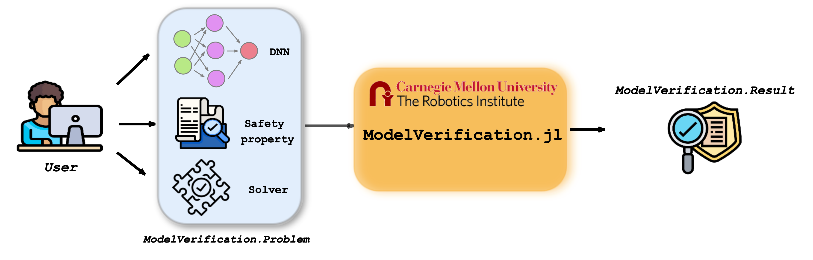
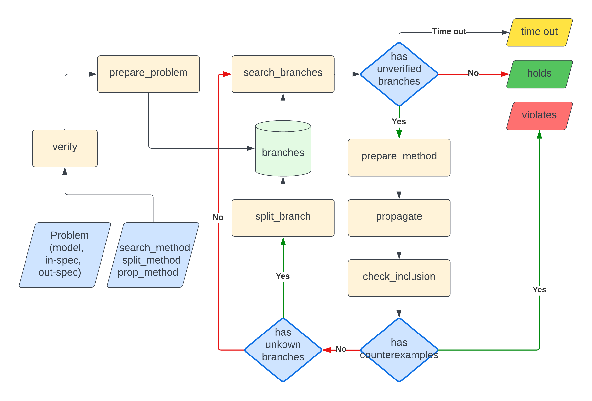

# ModelVerification.jl

```@contents
Pages=["index.md"]
```

## Introduction
Deep Neural Network (DNN) is crucial in approximating nonlinear functions across diverse applications, such as computer vision and control. Verifying specific input-output properties can be a highly challenging task. To this end, we present [ModelVerification.jl](https://github.com/intelligent-control-lab/ModelVerification.jl), the only cutting-edge toolbox that contains a suite of state-of-the-art methods for verifying DNNs. This toolbox significantly extends and improves the previous version ([NeuralVerification.jl](https://sisl.github.io/NeuralVerification.jl/latest/)) and is designed to empower developers and machine learning practioners with robust tools for verifying and ensuring the trustworthiness of their DNN models.

### Key features:
- _Julia and Python integration_: Built on Julia programming language, [ModelVerification.jl](https://github.com/intelligent-control-lab/ModelVerification.jl) leverages Julia's high-performance capabilities, ensuring efficient and scalable verification processes. Moreover, we provide the user with an easy, ready-to-use Python interface to exploit the full potential of the toolbox even without knowledge of the Julia language.
- _Different types of verification_: [ModelVerification.jl](https://github.com/intelligent-control-lab/ModelVerification.jl) enables verification of several input-output specifications, such as reacability analysis, behavioral properties (e.g., to verify Deep Reinforcement Learning policies), or even robustness properties for Convolutional Neural Network (CNN). It also introduces new types of verification, not only for finding individual adversarial input, but for enumerating the entire set of unsafe zones for a given network and safety properties.
- _Verification benchmarks_: Compare our or your verification toolboxes against state-of-the-art benchmarks and evaluation criteria ([VNN-Comp 2023](https://vnncomp.christopher-brix.de/)). [ModelVerification.jl](https://github.com/intelligent-control-lab/ModelVerification.jl) includes a collection of solvers and standard benchmarks to perform this evaluation efficiently.

## Setup
This toolbox requires Julia v1.5 or later. Refer the [official Julia documentation](https://julialang.org/downloads/) to install it for your system.

### Installation
To download this toolbox, clone it from the Julia package manager like so:

```Julia
pkg> add https://github.com/intelligent-control-lab/ModelVerification.jl/
```

### Develop the toolbox (for development)

_Deprecated once project is done and should be changed to "Building the package"._

Go to the toolbox directory and start the [Julia REPL](https://docs.julialang.org/en/v1/stdlib/REPL/). 
```Julia
julia > ]
(@v1.9) > develop .
(@v1.9) > activate .
(@v1.9) > instantiate
```

This will enable development mode for the toolbox. The dependency packages will also be installed. Some of the important ones are listed below. 
- [Flux](https://fluxml.ai/Flux.jl/stable/)
- [LazySets](https://juliareach.github.io/LazySets.jl/dev/)
- [JuMP](https://jump.dev/JuMP.jl/stable/)
- [Zygote](https://fluxml.ai/Zygote.jl/stable/)

## Overview of the toolbox


[ModelVerification.jl](https://github.com/intelligent-control-lab/ModelVerification.jl) receives input as a set consisting of:
- [Model](./network.md) to be verified,
- A [safety property](./safety_spec.md) encoded as input-output specifications for the neural network,
- The [solver](./solvers.md) to be used for the formal verification process.

The toolbox's [output](./problem.md) varies depending on the type of verification we are performing. Nonetheless, at the end of the verification process, the response of the toolbox potentially allows us to obtain provable guarantees that a given safety property holds (or does not hold) for the model tested.

For more details on how the toolbox works, please refer to the [tutorial](#tutorials) below.

## Quickstart
Here is a simple example for verifying that the user-given safety property holds for a small deep neural network (DNN) with a single input node, two hidden layers with two ReLU nodes, and a single output node. We use the formal verification results obtained through the reachability analysis to get a provable answer whether the safety property holds.

First, we load the relevant libraries and the [ModelVerification.jl](https://github.com/intelligent-control-lab/ModelVerification.jl) toolbox.
```Julia
using ModelVerification
using Flux
using LazySets
```

First, load the model.
```Julia
onnx_path = "models/small_nnet.onnx"
toy_model = build_flux_model(onnx_path)
```

Suppose we want to verify that all inputs in $\mathcal{X}=[-2.5, 2.5]$ are mapped into $\mathcal{Y}=[18.5, 114.5]$. We encode this safety property using convex sets, provided by [LazySets](https://juliareach.github.io/LazySets.jl/dev/). 
```Julia
X = Hyperrectangle(low = [-2.5], high = [2.5]) # expected out: [18.5, 114.5]
Y = Hyperrectangle(low = [18.5], high = [114.5]) # here we expect the property holds
```

Now, we construct a _Problem_ instance. Note that [ModelVerification.jl](https://github.com/intelligent-control-lab/ModelVerification.jl) converts the `.onnx` model into a [Flux](https://fluxml.ai/Flux.jl/stable/) model.
```Julia
problem = Problem(toy_model, X, Y)
```

Instantiate the `solver`, which in this case is [CROWN](https://arxiv.org/abs/1811.00866). We also need `search`, `split`, and `propagation` methods in addition to the `solver` and `Problem`.
```Julia
search_method = BFS(max_iter=100, batch_size=1)
split_method = Bisect(1)

use_gpu = false
lower_bound = true
upper_bound = true
solver = Crown(use_gpu, lower_bound, upper_bound)
```

Finally, we can verify that the safety property holds for this simple example!
```Julia
result = verify(search_method, split_method, solver, problem)
println(result)
println(result.status)
```

CROWN verifies that the input-output relationship holds!

## Tutorials
- [Tutorials](https://github.com/intelligent-control-lab/MV-test/blob/main/tutorial.ipynb)
    - Example 1: Verifying a toy DNN with reachability analysis
    - Example 2: Verifying a Deep Reinforcement Learning (DRL) policy for collision avoidance safety property
    - Example 3: Verifying a CNN for robustness safety property
<!-- - [MLP examples](https://github.com/intelligent-control-lab/MV-test/blob/main/test_mlp.ipynb)
- [CNN examples](https://github.com/intelligent-control-lab/MV-test/blob/main/test_cnn.ipynb)
- [MNIST examples](https://github.com/intelligent-control-lab/MV-test/blob/main/train_mnist.ipynb)
- [ACASXU examples](https://github.com/intelligent-control-lab/MV-test/blob/main/test_ACASXU.ipynb) -->

## Toolbox Outline


```@contents
Pages = ["problem.md", "network.md", "safety_spec.md", "branching.md", "propagate.md", "solvers.md", "attack.md", "utils.md"]
Depth = 3
```

## Python Interface
```@contents
Pages = ["nnet_converter.md"]
Depth = 3
```

## Benchmarks
```@contents
Pages = ["benchmark.md"]
Depth = 3
```