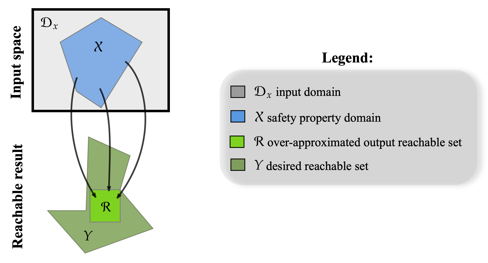
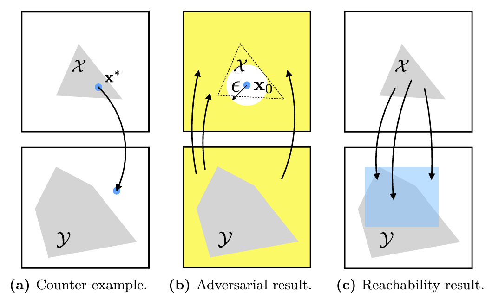

```@meta
CurrentModule = ModelVerification
```

```@contents
Pages=["problem.md"]
Depth = 3
```

# Problem Outline

Verification checks if the input-output relationships of a function, specifically deep neural networks (DNN) $\mathcal{F}$ in this case, hold. For an input specification imposed by a set $\mathcal{X}\subseteq \mathcal{D}_x$, we would like to check if the corresponding output of the function is contained in an output specification imposed by a set $\mathcal{Y}\subseteq \mathcal{D}_y$:

$$x\in\mathcal{X} \Longrightarrow y = \mathcal{F}(x) \in \mathcal{Y}.$$

Thus, a DNN-Verification problem consists of two main components:
- model (DNN) : $\mathcal{F}$
- safety property (input-output specification) : $\mathcal{X}, \mathcal{Y}$.



Due to the nonlinear and nonconvex nature of DNNs, estimating the exact reachable set is impractical, although there are algorithms that allow us to do this such as [ExactReach](https://arxiv.org/abs/1712.08163). Thus, we preform an over-approximation of the reachable set, called $\mathcal{R}$. We check its containment in the desired reachable set $\mathcal{Y}$ which if ture, we can assert that the safety property holds.

Below, we give a brief overview of models ([Network](#network)), [safety property](#safety-property), and [outputs (verification results)](#output-verification-results).

## Network
_Details on [Network](./network.md)_

## Safety Property
*Details on [Input-Output Specification](./safety_spec.md)*

## Output (Verification Results)
|        Output result       |  Explanation  | 
|----------------------------|:-----------:|
| [`BasicResult::hold`]      | The input-output constraint is always satisfied. |
| [`BasicResult::violated`]  | The input-output constraint is violated, i.e., it exists a single point in the input constraint that violates the property.         |
| [`BasicResult::timeout`]   | Could not be determined if the property holds due to timeout in the computation.        | 
| [`CounterExampleResult`]   | Like BasicResult, but also returns a counter_example if one is found (if status = :violated). The counter_example is a point in the input set that, after the NN, lies outside the output constraint set.        |
| [`AdversarialResult`]      | Like BasicResult, but also returns the maximum allowable disturbance in the input (if status = :violated).        | 
| [`ReachabilityResult`]     | Like BasicResult, but also returns the output reachable set given the input constraint (if status = :violated).        |
| [`EnumerationResult`]      | Set of all the (un)safe regions in the safety property's domain. |



## Problem
```@docs
Problem
prepare_problem(search_method::SearchMethod, split_method::SplitMethod, prop_method::PropMethod, problem::Problem)
```

## Result
```@docs
Result
BasicResult
CounterExampleResult
AdversarialResult
ReachabilityResult
```