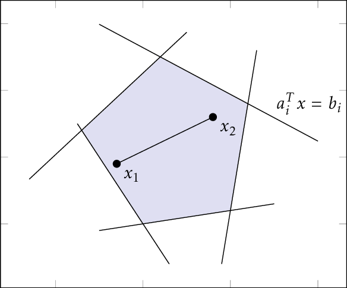
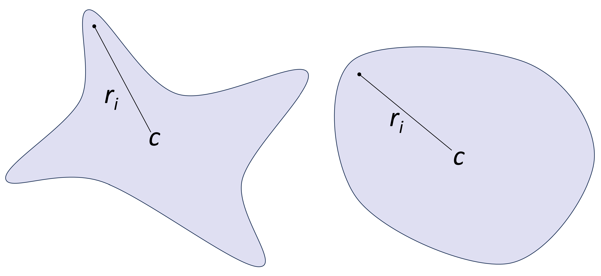

```@meta
CurrentModule = ModelVerification
```

```@contents
Pages=["safety_spec.md"]
Depth=3
```

# Input-Output Specification

## Safety Property
A safety property is essentially an input-output relationship for the model we want to verify. In general, the constraints for the input set $\mathcal{X}$ and the output set $\mathcal{Y}$ can have any geometry. For the sake of simplicity, [ModelVerification.jl](https://github.com/intelligent-control-lab/ModelVerification.jl) uses convex polytopes and the complement of a polytope to encode the input and output specifications. Specifically, our implementation utilizes the geometric definitions of [LazySets](https://juliareach.github.io/LazySets.jl/dev/), a Julia package for calculus with convex sets. The following section dives into the geometric representations [ModelVerification.jl](https://github.com/intelligent-control-lab/ModelVerification.jl) uses and the representations required for each solver. 

## Geometric Representation
Different solvers implemented in ModelVerification.jl require the input-output specification formulated with particular geometries. We report here a brief overview of the sets we use. For specifics, please read [_Algorithms for Verifying Deep Neural Networks_ by C. Liu, et al.](https://arxiv.org/abs/1903.06758)  and [Sets in `LazySets.jl`](https://juliareach.github.io/LazySets.jl/dev/lib/interfaces/#Set-Interfaces).

- HR = Hyperrectangle
- HS = HalfSpace
- HP = HPolytope
- SS = StarSet
- ZT = Zonotope
- IS = ImageStar
- IZ = ImageZono
- PC = PolytopeComplement

| **Solver**             | **Input Set**  | **Output Set** |
| ---------------------- | -------------- | -------------- |
| Ai2                    | HR, ZT, HP, SS | HP (bounded)   |
| CROWN                  | HR             | HP (bounded)   |
| $\alpha$-CROWN         | HR             | HP (bounded)   |
| $\beta$-CROWN          | HR             | HP (bounded)   |
| $\alpha$-$\beta$-CROWN | HR             | HP (bounded)   |


### Hyperrectangle ([`Hyperrectangle`](https://juliareach.github.io/LazySets.jl/dev/lib/sets/Hyperrectangle/#def_Hyperrectangle))
Corresponds to a high-dimensional rectangle, defined by

$$|x-c| \le r,$$

where $c\in\mathbb{R}^{k_0}$ is the center of the hyperrectangle and $r\in\mathbb{R}^{k_0}$ is the radius of the hyperrectangle.

### HalfSpace ([`HalfSpace`](https://juliareach.github.io/LazySets.jl/dev/lib/sets/HalfSpace/))
Represented by a single linear inequality constraint

$$a^\top x \le b,$$

where $a\in\mathbb{R}^{k_0}$ and $b\in\mathbb{R}$.

### Halfspace-Polytope ([`HPolytope`](https://juliareach.github.io/LazySets.jl/dev/lib/sets/HPolytope/#def_HPolytope))
[`HPolytope`](https://juliareach.github.io/LazySets.jl/dev/lib/sets/HPolytope/#def_HPolytope) uses a set of linear inequality constraints to represent a convex polytope, i.e., it is a bounded set defined using an intersection of half-spaces.

$$Ax \le b,$$

where $A\in\mathbb{R}^{k\times k_0}, b\in\mathbb{R}^k$ with $k$ representing the number of inequality constraints.

<center></center>
<center>Polytope made of halfspaces.</center>

### StarSet ([`Star`](https://juliareach.github.io/LazySets.jl/dev/lib/sets/Star/#def_Star))
Only convex star set is considered in this toolbox. A convex star set is an affine transformation of an arbitrary convex polytope,

$$x = c + \begin{bmatrix} r_1 & r_2 & \cdots & r_l \end{bmatrix} \alpha,\; C\alpha \le d,$$

where $c\in\mathbb{R}^{k_0}$ is the center of the star set, $r_i\in\mathbb{R}^{k_0},\; i\in\{1,\dots,l\}$ are generators of the star set, $C\in\mathbb{R}^{k\times l}$, $d\in\mathbb{R}^{k}$, $\alpha\in\mathbb{R}^l$ is the free parameter that belongs to a unit hypercube, and $k$ is the number of inequality constraints on $\alpha$. $l$ is the degree of freedom of the star set.

<center></center>
<center>The general starset, on the left, is not necessarily convex. We only consider convex starsets.</center>

### Zonotope ([`Zonotope`](https://juliareach.github.io/LazySets.jl/dev/lib/sets/Zonotope/#def_Zonotope))
`Zonotope` is basically as star set in which all predicate variables are in the range of $[-1, 1]$. Zonotope represents polytopes that can be written as affine transformations of a unit hypercube, defined as

$$x = c + \begin{bmatrix} r_1 & r_2 & \cdots & r_l \end{bmatrix} \alpha,\; |\alpha| \le 1,$$

where $c\in\mathbb{R}^{k_0}$ is the center of the zonotope, $r_i\in\mathbb{R}^{k_0},\; i\in\{1,\dots,l\}$ are generators of the zonotope, and $\alpha\in\mathbb{R}^l$ is the free parameter that belongs to a unit hypercube. $l$ is the degree of freedom of the zonotope.

### ImageStar
`ImageStar` is an extension of the star set where the center and generators are images with multiple channels.

$$x = c + \begin{bmatrix} r_1 & r_2 & \cdots & r_l \end{bmatrix} \alpha,\; C\alpha \le d,$$

where $c\in\mathbb{R}^{h\times w \times k_0}$ is the center image, $r_i\in\mathbb{R}^{h \times w \times k_0},\; i\in\{1,\dots,l\}$ are the generator iamges, $C\in\mathbb{R}^{k\times l}$, $d\in\mathbb{R}^{k}$, and $h,w,k$ are the height, width, and number of channels (input dimension) of the images respectively. $\alpha\in\mathbb{R}^l$ is the free parameter that belongs to a unit hypercube, and $k$ is the number of inequality constraints on $\alpha$. $l$ is the degree of freedom of the star set.

### ImageZono
`ImageZono` is an extension of the zonotope where the center and generators are images with multiple channels.

$$x = c + \begin{bmatrix} r_1 & r_2 & \cdots & r_l \end{bmatrix} \alpha$$

where $c\in\mathbb{R}^{h\times w \times k_0}$ is the center image, $r_i\in\mathbb{R}^{h \times w \times k_0},\; i\in\{1,\dots,l\}$ are the generator iamges, and $h,w,k$ are the height, width, and number of channels (input dimension) of the images respectively. $\alpha\in\mathbb{R}^l$ is the free parameter that belongs to a unit hypercube and $l$ is the degree of freedom of the zonotope.

### PolytopeComplement ([`Complement`](https://juliareach.github.io/LazySets.jl/stable/lib/lazy_operations/Complement/))
`PolytopeComplement` is a type that represents the complement of a polytope, that is the set

$$Y = X^c = \{ y\in\mathbb{R}^n : y \notin X \}.$$

### References
[1] C. Liu, T. Arnon, C. Lazarus, C. Strong, C. Barret, and M. J. Kochenderfer, "Algorithms for Verifying Deep Neural Networks," in _Foundations and Trends in Optimization_, 2021.

[2] T. Gehr, M. Mirman, D. Drashsler-Cohen, P. Tsankov, S. Chaudhuri, and M. Vechev, "Ai2: Safety and Robustness Certification of Neural Networks with Abstract Interpretation," in *2018 IEEE Symposium on Security and Privacy (SP)*, 2018.

[3] M. Forets and C. Schilling, "LazySets.jl: Scalable Symbolic-Numeric Set Computations," in _Proceeds of the JuliaCon Conferences_, 2021.

[4] HD. Tran, S. Bak, W. Xiang, and T.T. Johnson, "Verification of Deep Convolutional Neural Networks Using ImageStars," in _Computer Aided Verification (CAV)_, 2020.

## `Spec`

### Specifications
```@docs
Spec
InputSpec
OutputSpec
```

```@docs
ImageConvexHull
LinearSpec
classification_spec(n::Int64, target::Int64)
```

### Functions
```@docs
get_size(input_spec::LazySet)
get_size(input_spec::ImageConvexHull)
get_linear_spec(batch_out_set::AbstractVector)
```