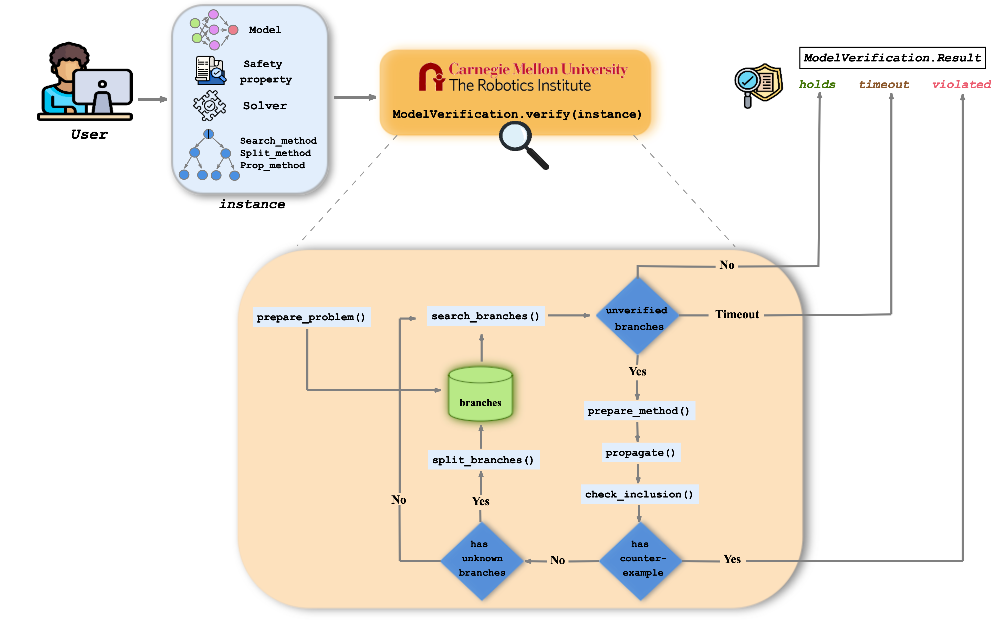

```@meta
CurrentModule = ModelVerification
```

```@contents 
Pages=["toolbox_flow.md"]
Depth=2
```

_Please note that this page is under construction._

# Flow


_This page serves to explain the overall flow of the toolbox. For examples and explanation on how to use specific verification functions, please refer to the [tutorials](./index.md#tutorials)._ 

In general, verification algorithms follow the paradigm of _Branch and Bound_. This process can be summarized into three steps:

1. split the input set into smaller sets, which we call "branches",
2. propagate the bound through the model for a given branch,
3. check whether the bound of the final layer satisfies the output specificaiton.

Repeat or terminate the process based on the result.

[ModelVerification.jl](https://github.com/intelligent-control-lab/ModelVerification.jl) uses a modularized code structure to support various combinations of search methods, split methods, and solvers for a variety of neural network architectures and geometric representations for the safety specifications. After reading through this section, the user should have an overall idea of the flow of the toolbox and the design philosophy behind it. Thanks to the highly modularized structure of the toolbox, the user can add additional functionalities at any layer of the verification process. 

### Definition of Terms
Here, we define some terms that are unique to the toolbox or are used differently compared to the typical usage.

- **Instance**: combination of all the necessary information to define an "instance" of neural network verification problem. This is consisted of: 
    - [problem](./problem.md)
    - [solver](./solvers.md)
    - [search methods](./branching.md#search)
    - [split methods](./branching.md#split)
- **Propagation Method**: this is the bound propagation method used for verifying the problem. In other words, it is the choice of term to represent the ["solver"](./solvers.md): all the solvers in [ModelVerification.jl](https://github.com/intelligent-control-lab/ModelVerification.jl) are represented as a propagation method. However, this is different from the [methods in `propagate.jl`](./propagate.md). This will be clearer in the following explanations.
- **Model / (Deep) Neural Network / Network**: these terms are used interchangeably and represent the deep neural network (DNN) to be verified.
- **Node**: (This is not equivalent to a "neuron" in a traditional deep learning sense.) This refers to a "node" in a computational-graph sense.
- **Layer**: (This is not equivalent to a "layer" in a traditional deep learning sense.) This refers to an operation at a node, such as ReLU activation function.
- **BaB**: "Branch-and-Bound" is a method that creates a binary tree for the search space where the verification is employed. 
- **Set vs Bound**: One set is composed of bounds. E.g., for the output reachable set is a union of output bounds. But we use these terms interchangeably throughout the toolbox.

## 1. Creating an instance: _what kind of verification problem do you want to solve?_
Let's first create an instance. An instance contains all the information required to run the [`verify`](@ref) function. This function does the heavy-lifting where the verification problem is solved. As long as the user properly defines the problem and solver methods, this is the only function the user has to call. To run [`verify`](@ref), the user has to provide the following arguments. These collectively define an "instance":

- [`SearchMethod`](@ref): Algorithm for iterating through the branches, such as `BFS` (breadth-first search) and `DFS` (depth-first search).
- [`SplitMethod`](@ref): Algorithm for splitting an unknown branch into smaller pieces for further refinement. This is also used in the first step of [`verify`](@ref) to populate the branches bank. In other words, it splits the input specification into branches to facilitate the propagation process.
- [`PropMethod`](@ref): Solver used to verify the problem, such as `Ai2` and `Crown`.
- [`Problem`](@ref): Problem to be verified. It consists of a [`Network`](@ref), and [input and output specifications](./safety_spec.md).

This toolbox design choice allows for extensive customization of methods and solvers by defining different search or split methods. The user simply needs to add their chosen methods in the specific files (`search.jl` and `split.jl`), which the solvers will automatically use for the verification process.

### [`SearchMethod`](@ref)
`SearchMethod` describes the strategy the solver uses when iterating through the branches. Currently, [ModelVerification.jl](https://github.com/intelligent-control-lab/ModelVerification.jl) only supports Breath-first Search (BFS). The solver can exploit parallel analysis of the nodes in the BaB by indicating a `batch_size` is greater than 1. 

### [`SplitMethod`](@ref)
`SplitMethod` specifies how many splits and where they are performed on a single node of the BaB. Depending on the `SplitMethod`, the solver will split either the input space or the ReLU nodes.

The following split methods are supported:
- Bisectection (`Bisect`): splits either the input space or the ReLU nodes.
- Branch-and-bound (`BaBSR`): splits the ReLU nodes.

### [`PropMethod`](@ref)
`PropMethod` is the solver to be used for the verification.

The following solvers are supported:
- ExactReach
- Ai2
- ImageStar
- ImageZono
- Crown
- $\alpha$-Crown
- $\beta$-Crown

### [`Problem`](@ref)
`Problem` is composed by the model to be verified and the input & output specifications. Specifically, this part of the "instance" encodes what we want to verify rather than how we achieve the formal verification results.

- For information on how to load or convert models and how they are represented in [ModelVerification.jl](https://github.com/intelligent-control-lab/ModelVerification.jl), please refer [Network](./network.md).
- For the different geometric representations for the input and output specifications, please refer [Input-Output Specification](./safety_spec.md). 


## 2. Verifying the instance: _spinning through the branches - where the magic happens!_
[`verify`](@ref) is the main function called by [ModelVerification.jl](https://github.com/intelligent-control-lab/ModelVerification.jl) to start the verification process of the "instance" provided by the user.

```@docs
verify
```

### `prepare_problem`
The first step of [`verify`](@ref) is `prepare_problem` which preprocesses the `Problem` into a form that is compatible with the verification solver. Its main two functionalities are:

1. Retrieves the model information and stores it inside `model_info`,
2. Exploits the `init_bound` function which returns the geometry representation that matches the solver requirements. For instance, since CROWN is a backward propagation method, the `init_bound` function returns the geometry used to encode the output specification. 

The result of `prepare_problem` are two variables:
1. `model_info`: structure that contains information about the `Flux` model,
2. `prepared_problem`: `Problem` with a processed input-output specification.


### `search_branches`

```@docs
search_branches(search_method::BFS, split_method, prop_method, problem, model_info)
advance_split(max_iter::Int, search_method::BFS, split_method, prop_method, problem, model_info)
```

`search_branches` is the core function used for the verification process. It consists of several subfunctions that we are going to summarize in the following. At first, the function initializes the branch bank for the entire safety property's input-output domain. This can be done by `advance_split`, which splits the input-output domain using the given split method. Thus, each "branch" is a subpart of the input-output domain. The function seeks to verify all the branches and if it cannot provide a result (i.e., we obtain an `:unknown` answer), the function proceeds to split branch for a more refined verification process.. If the function verifies all the branches within the given maximum number of iterations, then we obtain a `:holds` answer. If the function finds any branch that does not satisfy the safety property, then it returns `:violated`.

For each iteration, i.e., for each branch, the function calls the following subfunctions to verify the branch:

1. `prepare_method`: this function retrieves all the information to perform either the forward or backward propagation of the input domain of the branch.  The result is stored in two variables called `batch_out_spec`, `batch_info`, which contain the batch of the outputs and a dictionary containing all the information of each node in the model. `prepare_method` calls the following functions in sequence:
    - `init_propagation`: Differentiates between `ForwardProp` and `BackwardProp`. If the solver being used employs a forward propagation method, then we start propagating from the input nodes. If it employs a backward propagation method, then we start from the output nodes.
    - `init_batch_bound`: Calls `init_bound`, which returns either the input or output geometry representation based on the type of propagation to perform.
   
2. The result of the previous function is then used in the [`propagate`](@ref) function. This function propagates the starting bounds through the model using the specified propagation method, i.e., the solver. The `propagate` function acts as the overall logic for propagating the branch through the model and performs the propagation based on the layer operation (linear, ReLU, etc.) and the geometric representation for the bounds. The user can add additional layer operators in the `propagate/operators` folder. Moreover, the toolbox supports skip connections. The `propagate` function returns `batch_bound`, the bound of the output node, and an augmented `batch_info` dictionary with the output bound information added.

3. Now, `process_bounds` returns the reachable bounds obtained from the `propagate` function. Depending on the solver, the reachable bounds may be post-processed to optimized the verification procedure.

4.  Finally, `check_inclusion` checks for the overlapping between the reachable bounds obtained from the propagation and the safety property's output bounds. Since we are using overapproximation of the output reachable set, the only case in which we can obtain `:holds` result is when the output reachable set is fully contained in the user-specified output set. On the other hand, the `:violated` result is only possible when the sets are completely disjoint. In all other cases, we have an `:unknown` answer and we proceed with the branch splitting method below to populate the branch bank.

5.  `split_branch` is used to split the current branch with `:unknown` answer into two separate branches which are split based on the `split_method`. The sub-branches are then added to the "branches" bank.

We continue this loop until either get a `:violated` result, a `:hold` result for all the branches, or reach the maximum number of iterations.


### `search_adv_input_bound`
If the verification result from `verify` is not `:holds`, i.e., either `:unknown` or `:violated`, then [`search_adv_input_bound`](@ref) searches for the maximul input bound that can pass the verification, i.e., retrieves `:holds`, with the given setting. This information is passed to the [`ResultInfo`](@ref) as a dictionary field so that the user can check.

```@docs
search_adv_input_bound
```

## 3. Results and how to interpret them: _so is my model good to go?_
Once the `verify` function is over, it returns a [`ResultInfo`](@ref) that contains the `status` (either `:hold`, `:violated`, `:unknown`) and a dictionary that contains any other additional information needed to understand the verification results in detail, such as the verified bounds, adversarial input bounds, etc.

The following are the `Result` types used interally for the toolbox to differentiate between different verification results. The result is either a `BasicResult`, `CounterExampleResult`,  `AdversarialResult`, `ReachabilityResult`, or `EnumerationResult` (to-be-supported). The `status` field is either `:violated`, `:holds`, or `:unknown`.

|        Output result       |  Explanation  | 
|----------------------------|:-----------:|
| [`BasicResult::holds`]      | The input-output constraint is always satisfied. |
| [`BasicResult::violated`]  | The input-output constraint is violated, i.e., it exists a single point in the input constraint that violates the property.         |
| [`BasicResult::unknown`]   | Could not be determined if the property holds due to timeout in the computation.        | 
| [`CounterExampleResult`]   | Like BasicResult, but also returns a counter_example if one is found (if status = :violated). The counter_example is a point in the input set that, after the NN, lies outside the output constraint set.        |
| [`AdversarialResult`]      | Like BasicResult, but also returns the maximum allowable disturbance in the input (if status = :violated).        | 
| [`ReachabilityResult`]     | Like BasicResult, but also returns the output reachable set given the input constraint (if status = :violated).        |
| [`EnumerationResult`]      | Set of all the (un)safe regions in the safety property's domain. |

For more information, please refer to [_Output (Verification Results)_](./problem.md#result).